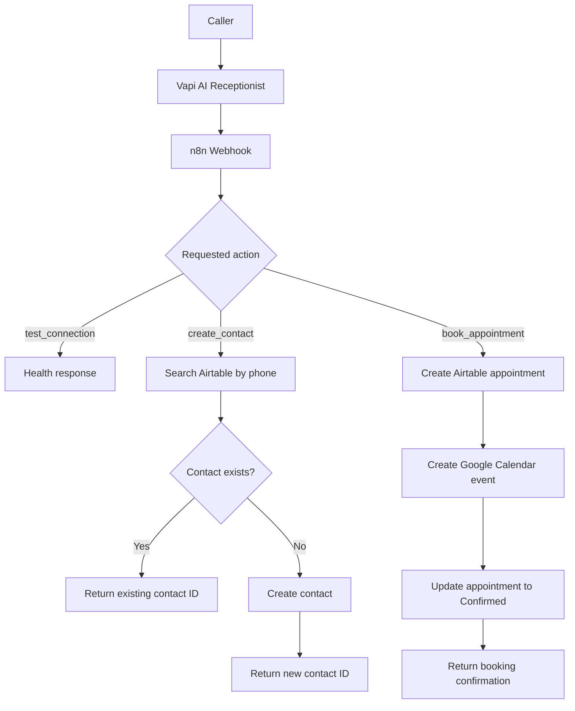
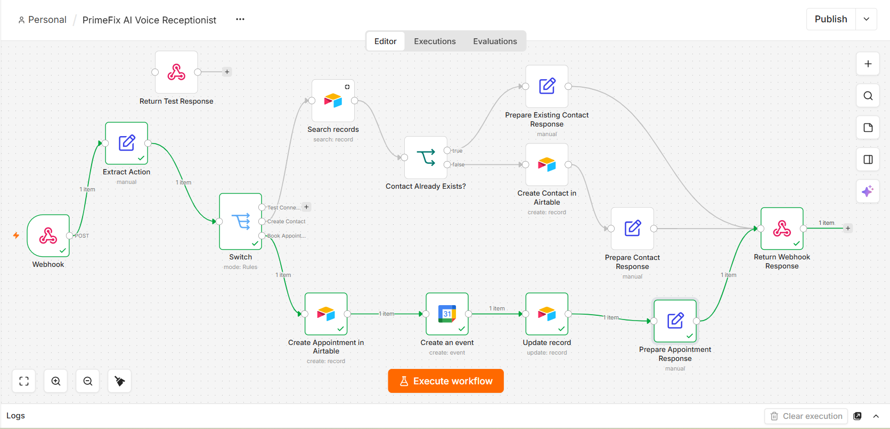
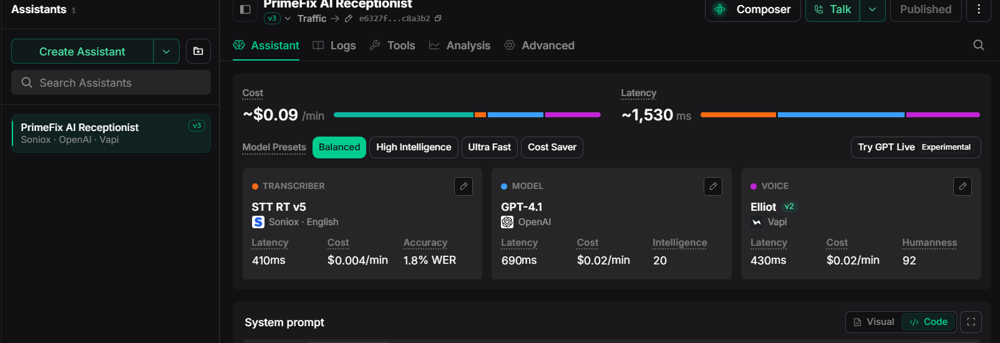
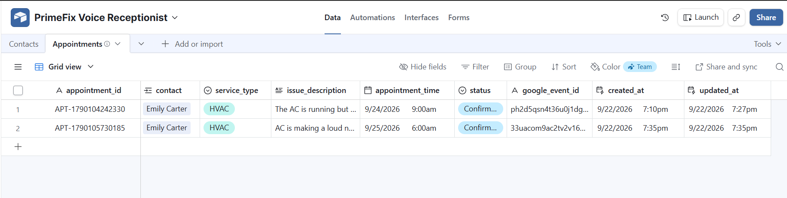
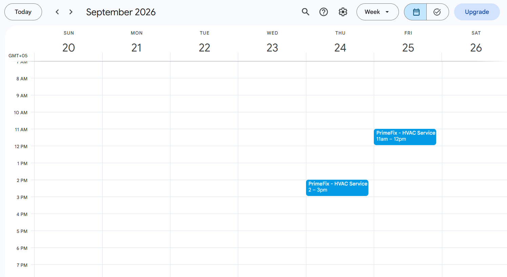

# PrimeFix AI Voice Receptionist

An end-to-end AI voice receptionist and appointment-booking automation for a home-maintenance business. The assistant collects customer details, prevents duplicate contacts, creates service appointments, synchronizes confirmed bookings with Google Calendar, and returns structured results to the caller.

> This repository contains a sanitized n8n workflow, the Vapi system prompt, setup documentation, and screenshots using synthetic demonstration data. No credentials are included.

## What the project demonstrates

- Natural voice intake using Vapi, speech-to-text, an LLM, and text-to-speech
- Structured tool calls for contact creation and appointment booking
- One production webhook supporting multiple actions
- Phone-based contact lookup and duplicate prevention
- Linked Contacts and Appointments tables in Airtable
- Google Calendar event creation with a one-hour service window
- Appointment lifecycle update from `Requested` to `Confirmed`
- Structured JSON responses for reliable assistant confirmations
- Emergency-safety instructions and protection against invented pricing or availability

## Architecture



## Technology stack

| Component | Purpose |
| --- | --- |
| Vapi | Voice assistant orchestration and API tools |
| Soniox STT | Real-time speech transcription |
| OpenAI GPT-4.1 | Conversation reasoning and structured tool use |
| Vapi voice | Spoken assistant responses |
| n8n Cloud | Webhook routing, validation, branching, and integrations |
| Airtable | Contacts and appointment records |
| Google Calendar | Confirmed appointment scheduling |
| Postman | Webhook and response testing |

## Core workflow routes

### `test_connection`

Verifies that the production webhook is reachable and returns a health response.

### `create_contact`

1. Extracts the caller's name, phone, email, and service address.
2. Searches the Contacts table using the phone number.
3. Returns the existing Airtable record ID when a match is found.
4. Otherwise creates a new contact and returns its record ID.

### `book_appointment`

1. Receives the previously returned `contact_id`.
2. Creates a linked appointment with status `Requested`.
3. Creates a one-hour Google Calendar event.
4. Stores the Google event ID and changes the appointment status to `Confirmed`.
5. Returns the appointment ID, status, and calendar event ID.

## Repository structure

```text
PrimeFix-AI-Voice-Receptionist/
├── README.md
├── LICENSE
├── .gitignore
├── n8n/
│   └── PrimeFix_AI_Voice_Receptionist.sanitized.json
├── vapi/
│   └── system-prompt.txt
└── docs/
    ├── airtable-schema.md
    ├── api-examples.md
    ├── upwork-portfolio.md
    └── screenshots/
```

## Setup

### 1. Create the Airtable base

Create `Contacts` and `Appointments` tables using [the documented schema](docs/airtable-schema.md). Link the `contact` field in Appointments to the Contacts table.

### 2. Import the n8n workflow

Import [`n8n/PrimeFix_AI_Voice_Receptionist.sanitized.json`](n8n/PrimeFix_AI_Voice_Receptionist.sanitized.json) into n8n.

After importing:

1. Connect your Airtable personal access token credential.
2. Replace `YOUR_AIRTABLE_BASE_ID`.
3. Replace `YOUR_CONTACTS_TABLE_ID` and `YOUR_APPOINTMENTS_TABLE_ID`.
4. Connect your Google Calendar OAuth credential.
5. Replace `YOUR_GOOGLE_CALENDAR_ID`.
6. Confirm that the workflow timezone matches the assistant's timezone.
7. Publish the workflow and copy its production webhook URL.

### 3. Configure the Vapi assistant

Use [`vapi/system-prompt.txt`](vapi/system-prompt.txt) as the assistant's system prompt. Create two POST API Request tools that call the n8n production webhook.

`create_contact` request body:

```json
{
  "action": "create_contact",
  "name": "Emily Carter",
  "phone": "+15551112222",
  "email": "emily.carter@example.com",
  "service_address": "725 Pine Street, Austin, TX"
}
```

`book_appointment` request body:

```json
{
  "action": "book_appointment",
  "contact_id": "recXXXXXXXXXXXXXX",
  "service_type": "HVAC",
  "issue_description": "The air conditioner is making a loud noise.",
  "appointment_time": "2026-10-12T14:00:00+05:00"
}
```

Use an ISO 8601 appointment value with an explicit UTC offset. Update the system prompt if your business operates outside `Asia/Karachi`.

### 4. Test before connecting a phone number

Test the webhook routes with Postman, then run a controlled Vapi browser call. Confirm that:

- Existing contacts are reused rather than duplicated.
- New contacts are created with all supplied fields.
- Appointments link to the correct contact.
- Calendar events use the intended date, time, and duration.
- The assistant only announces success after receiving a successful tool response.

See [API examples](docs/api-examples.md) for sample responses.

## Screenshots

### Successful n8n execution



### Vapi assistant configuration



### Airtable appointments



### Google Calendar synchronization



## Security notes

- The public workflow intentionally contains no credential IDs, tokens, personal calendar address, or Airtable resource IDs.
- Keep API credentials inside n8n and Vapi credential stores.
- Protect production webhooks with authentication before using this pattern for real customer data.
- Avoid logging unnecessary personal information and follow applicable privacy requirements.
- All visible customer records in this repository are synthetic test data.

## Current scope and possible extensions

The showcase focuses on contact deduplication and appointment creation. Production extensions could include real-time availability checks, rescheduling and cancellation tools, SMS/email reminders, escalation to a human, business-hours rules, authentication, retry handling, and monitoring.

## License

Released under the [MIT License](LICENSE).
